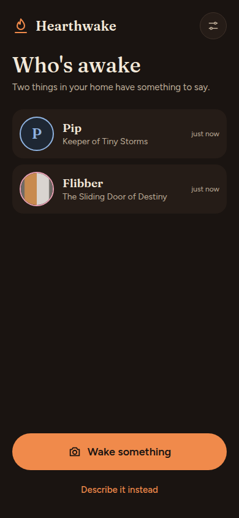
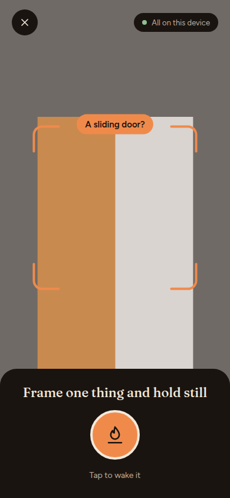
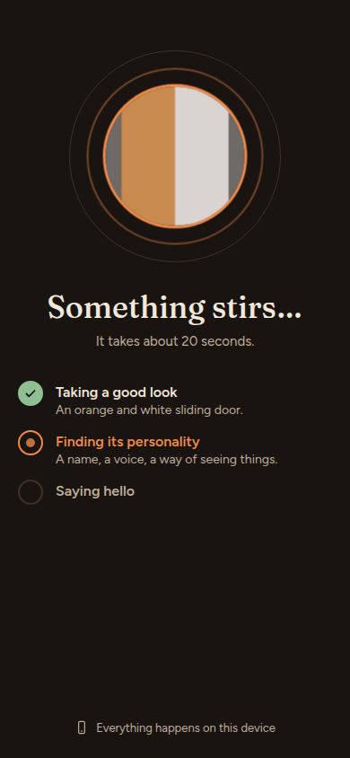
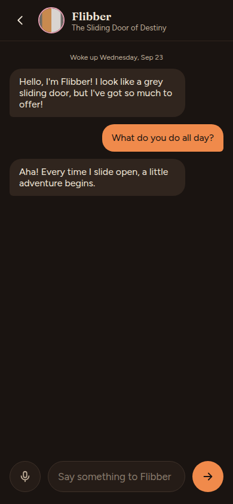

# Hearthwake

Household objects wake up and talk, with every AI model running locally in the browser.

Current milestone: **M1 app**. M0, the feasibility spike, showed that an iPhone can wake a household object and talk to it with the AI running in the browser. Its conclusions are in [ADR 0018](docs/decisions/0018-close-m0.md), and the spike's spec in [`docs/m0-spike.md`](docs/m0-spike.md).

  
  
  
  

Screenshots use the mock engine (`?mock`). On a real device the replies come from the on-device model.

What it does:

- **Wake things** with the camera (or a description). Each one gets a name, a personality and a voice, and remembers what you tell it.
- **Recognises** things that already woke up, and greets you like an old friend when you come back.
- **Play**: two things talk to each other, or play a treasure hunt where one gives a riddle and the camera confirms the find. Share any soul as a card.
- **English or Spanish**, and a choice of model (Llama 3.2 1B, Qwen 2.5 1.5B, Llama 3.2 3B).
- **Lab**: a device benchmark, a private diary and a label reader, with the same on-device AI.

- App: [`app/`](app/) (Vite + React + TypeScript), live at `https://ezar.github.io/hearthwake/`. Run `npm ci && npm run dev` inside it; add `?mock` to the URL to try it without WebGPU.
- Spike code: [`poc/`](poc/) (Vite + TypeScript), kept as the M0 test harness. Run `npm ci && npm run dev` inside it.
- Live spike: `https://ezar.github.io/hearthwake/poc/`.
- Results: [`docs/models.md`](docs/models.md). Decisions: [`docs/decisions/`](docs/decisions/).
